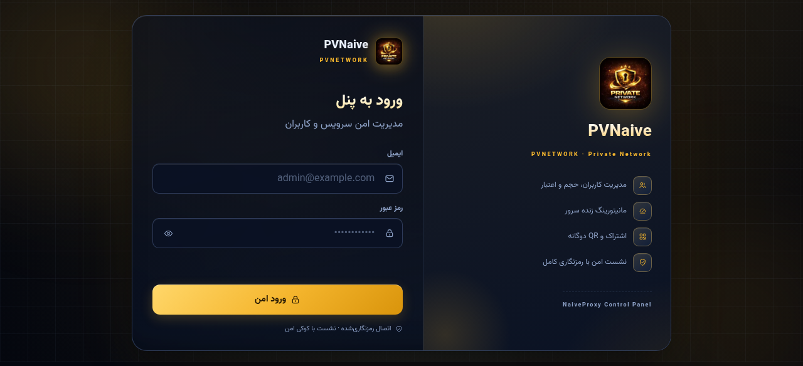
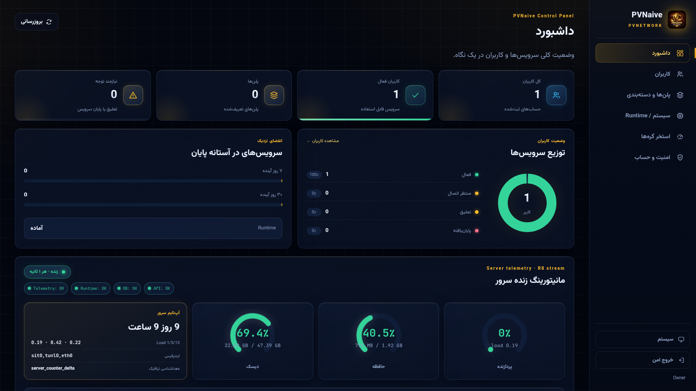

# PVNaive

<p align="center">
  
</p>

**PVNaive** is a production-grade management panel for **NaiveProxy**, built as a single Go binary with an embedded Caddy forward-proxy, PostgreSQL 18, and a React (Vite + TypeScript) control panel served under `/panel/`. It manages customers, quota/validity, subscriptions with dual QR delivery, live server telemetry, a node pool with automatic best-server switching, and role-based administration.

> Status: **live at `https://naive.softarg.ir/panel/`** · Go + Web (117) test suites green · schema v34 · [نسخه فارسی](README.fa.md)

<p align="center">
  
  
</p>

---

## Table of contents

1. [One-line install on any fresh server](#one-line-install)
2. [Requirements](#requirements)
3. [Panel guide — every page and button](#panel-guide)
4. [Subscriptions & QR delivery](#subscriptions--qr-delivery)
5. [Connecting clients (Karing / NekoBox / NekoRay)](#connecting-clients)
6. [Adding a node & automatic best-server switching](#adding-a-node)
7. [Architecture](#architecture)
8. [Security model](#security-model)
9. [Tests & deployment](#tests--deployment)
10. [Roadmap](#roadmap)

---

## One-line install

Run this on any fresh Ubuntu/Debian server (replace `panel.example.com` with your DNS name):

```bash
PVNAIVE_DOMAIN=panel.example.com bash <(curl -fsSL https://raw.githubusercontent.com/DashSaman/PV-NativePanel/main/docker/install.sh)
```

The installer clones the repository, generates strong secrets, builds the Docker image, starts the stack and prints the panel URL, owner credentials and a ready-to-use `naive+https://` bootstrap account. Secrets persist in `data/.env` (mode 0600); re-running the command upgrades an existing installation in place (forward-only checksum-verified migrations).

Optional overrides: `PVNAIVE_BRANCH`, `PVNAIVE_OWNER_EMAIL`, `PVNAIVE_OWNER_PASSWORD`, `PVNAIVE_PROXY_USER`, `PVNAIVE_PROXY_PASSWORD`, `PVNAIVE_INSTALL_DIR`, `PVNAIVE_DATA_DIR`.

## Requirements

- Ubuntu 20.04+ / Debian 11+, 1 GB RAM minimum, root access.
- Docker + Compose v2 (`curl -fsSL https://get.docker.com | sh`).
- Ports **80** and **443** free.
- A DNS `A` record pointing to the server (for a valid Let's Encrypt certificate). Without a domain the installer falls back to the server IP with a self-signed certificate.

---

## Panel guide

| Page | What it does |
| --- | --- |
| **Login** `#/login` | "Gold Reception" split card: brand hero with floating 3D mark, always-visible email/password fields with icons and gold focus rings, optional TOTP, show/hide password. |
| **Dashboard** `/` | KPI cards (perspective hover), service-distribution donut, 7/30-day expiry outlook, **live server console** — CPU/RAM/disk gauges (center = percent, chip below = real usage), live network chart with crisp HTML labels, uptime/load. All numerals are Persian digits. |
| **Customers** `#/customers` | Create/edit/suspend/revoke, quota add/set, renew, next plan, reset usage, active sessions, dual-QR dialog, bulk operations, advanced filters. |
| **Catalog** `#/catalog` | Plans / groups / tags with concurrency limits and start policies. |
| **Runtime** `#/runtime/naive` | Live runtime credentials, import/rotate with validate/apply/rollback revisions; the Caddy `basic_auth` block always mirrors the database. Abandoned-reservation reconciler keeps connectivity after unclean restarts. |
| **Pool** `#/pool` | Node inventory with health/sync state, one-time enrollment tokens, signed manifests, maintenance mode, revision publishing. |
| **Security** `#/settings/security` | Own password, MFA-TOTP with recovery codes, active sessions with per-session kill. |

---

## Subscriptions & QR delivery

| Path | Audience | Behavior |
| --- | --- | --- |
| `/sub/<token>` | Clients | Machine output negotiated by User-Agent: raw naive, sing-box JSON (Karing), Clash/Mihomo YAML, base64 v2ray. **Opening it in a browser now redirects to the account page instead of downloading a file.** `?family=` forces a format. |
| `/s/<token>` | Humans | Read-only account page: usage, quota, expiry, both QRs, full connection guide (FA/EN). |
| Panel dialog | Owner | Same data with both QRs and copy buttons — strictly read-only. |

The client profile is auto-named `PVNaive-<username>` (URI fragment + filename + sing-box tag), so scanning the QR in Karing fills the remark automatically.

---

## Connecting clients

Supported and verified clients: **Karing** (recommended) and **NekoBox / NekoRay**.

| Client | Platform | Fastest path |
| --- | --- | --- |
| **Karing** (recommended) | Android / iOS / Windows / macOS | "+" → scan the subscription QR — profile is imported as `PVNaive-<username>` |
| NekoBox / NekoRay | Android / Desktop | New subscription group, or import the `naive+https://` URI from clipboard |

---

## Adding a node

1. **Install the second server exactly like the first** — same one-line command with that server's domain/IP.
2. In the main panel open `#/pool` → **issue an enrollment token** (shown once).
3. Enroll the node (name + token + service address). The panel replicates runtime credentials to the node and publishes a signed manifest.
4. Wait for the node row to turn **healthy and in sync (Applied = Desired)**; leave maintenance mode.
5. Every client subscription refresh now includes all healthy pool nodes: Karing/sing-box get a **`PV-AUTO` urltest group** probing every node every 5 minutes (50 ms tolerance) and always using the fastest; Mihomo gets the same via its proxy-provider (hot updates every 4 h). Removing or draining a node is transparent to users.

---

## Architecture

```
┌──────────────────────── pvnaive container ─────────────────────────────┐
│  React panel (/panel)     Go API (:8080)     Caddy (:80/:443)          │
│   ├─ Vite build           ├─ /api/v1/*        ├─ TLS (Let's Encrypt)    │
│   ├─ RTL glass theme      ├─ SSE stream       ├─ forward_proxy (naive)  │
│   └─ local QR encoder     ├─ RBAC             ├─ /sub /s /panel         │
│                           ├─ accounting       └─ accounting socket ◄──┤ │
│                           └─ fleet/pool mTLS       exact byte counting │
│  PostgreSQL 18 (schema v34, forward-only migrations, encrypted backups)│
└─────────────────────────────────────────────────────────────────────────┘
```

- **Exact byte accounting** per credential/session with restart-resilient baselines and audited resets; the migration-0034 availability gate blocks only on live pending reservations, and a periodic reconciler releases abandoned ones (crash-safe).
- **First-connection validity** starts only on an authenticated CONNECT — never by opening the panel or reading a QR.
- **Steering / cover site** (default off) and **fleet mTLS pull** are wired.

---

## Security model

- Sessions: `__Host-pvnaive_session` + CSRF, UA-bound; optional MFA (TOTP + recovery codes).
- Secrets: runtime credentials AES-GCM encrypted; subscription tokens stored as SHA-256; generated passwords shown once.
- Read-only operations (viewing QRs, copying links) are contract-tested to mutate nothing.
- `/s/` is private: `noindex` + locked-down headers.

---

## Tests & deployment

```bash
# Go tests
go test ./...

# Web tests (117)
cd web && npx vitest run

# One-line install/upgrade on any server
PVNAIVE_DOMAIN=panel.example.com bash <(curl -fsSL https://raw.githubusercontent.com/DashSaman/PV-NativePanel/main/docker/install.sh)
```

Deployment rules: full database backup before every deploy; forward-only checksum-verified migrations; credentials reconciled from the database at boot; `GET /api/v1/health/ready` probe gates traffic.

---

## Roadmap

### Done

| Area | Delivered |
| --- | --- |
| Domain | `naive.softarg.ir` live (panel + subscriptions + TLS) |
| Theme | "Private Gold on Midnight Glass" + dimensional depth: perspective hovers, living aurora, chart halos, floating login |
| Numerals | Fully consistent Persian digits across every page (previously mixed) |
| Charts | HTML axis labels (fixes stretched numerals), percent-centered gauges with usage chips |
| `/sub/` in browsers | Redirects to the account page instead of downloading |
| Connectivity | Abandoned-reservation reconciler (v34) — crashes no longer brick users |
| Auto profile naming | `PVNaive-<username>` in URI, filename and sing-box tags |
| One-line installer | `install.sh` — auto clone, secrets, build, health check |
| Auto best-server | Healthy pool nodes join subscriptions; `PV-AUTO` picks the fastest |

### Remaining

| Area | Item |
| --- | --- |
| Pool PKI | certificate rotation and fail-closed revocation |
| R6-FLIP | cover/persona pipeline before default-on |
| Reseller shop | public purchase flow on the reseller ledger |

---

## Design credits

The visual methodology (glass surfaces, dimensional layering, gold accent system, hover/tilt motion) follows the open-source **[ui-ux-pro-max](https://github.com/nextlevelbuilder/ui-ux-pro-max-skill)** dataset — Glassmorphism, Dimensional Layering and Real-Time Monitoring profiles — adapted to RTL Persian with Vazirmatn and JetBrains Mono.
