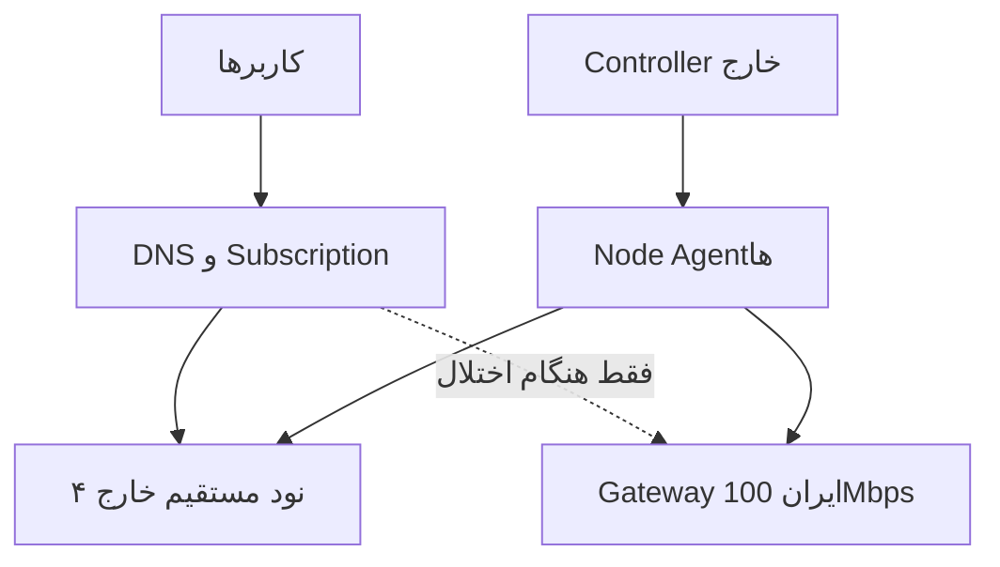

# معماری پیشنهادی Production

## توپولوژی

پنل در مسیر ترافیک کاربر قرار نمی‌گیرد. قطع Controller نباید sessionهای موجود یا login جدید با state قبلی را متوقف کند.

## اجزا

### Controller

- API و Web UI
- PostgreSQL
- Redis/queue برای job و lock
- desired-state store و audit log
- user/quota/expiry/group/RBAC
- node/host/routing policy
- subscription renderer
- scheduler، health aggregation و alert
- append-only usage ledger

### Node Agent

- اتصال خروجی‌محور به Controller با mTLS
- ثبت هویت پایدار نود
- pull/watch desired state
- validate → stage → apply → verify → ack
- نگه‌داشتن last-known-good و rollback
- مدیریت runtime، certificate و credential
- ارسال delta آمار، health و capacity
- drain، maintenance و canary

Controller نباید برای مدیریت روزمره SSH مستقیم لازم داشته باشد.

### Data plane

- Listener اصلی: TCP/443، TLS معتبر، HTTP/2
- Naive استاندارد و به‌روز
- credential یکتا برای هر subscription/user/device policy
- fallback web واقعی در پاسخ probe نامعتبر
- محدودسازی connection/rate با احتیاط و بدون ایجاد fingerprint غیرعادی

## مدل‌های اصلی داده

- `User`: وضعیت، حجم، انقضا، گروه، owner/reseller
- `Credential`: secret hash/identifier، user، revision، زمان rotation
- `Node`: identity، region، capacity، labels، state
- `Host`: domain/SNI/port، node scope، priority، state
- `Assignment`: نگاشت user/group به node pool
- `Policy`: quota/reset/device/concurrency/routing
- `DesiredRevision` و `AppliedRevision`
- `UsageDelta` و `UsageLedger`
- `HealthSample` و `Incident`
- `SubscriptionToken`: hash، expiry، revoke و rotation
- `AuditEvent`

## حسابداری مصرف

قاعده‌ها:

1. Node فقط delta دارای `node_id + boot_id + sequence` می‌فرستد.
2. Controller با کلید idempotency از دوباره‌شماری جلوگیری می‌کند.
3. counter reset/restart با boot_id تشخیص داده می‌شود.
4. ledger append-only است؛ aggregateها قابل بازسازی‌اند.
5. اختلاف node total، interface total و user total پایش می‌شود.
6. enforcement محلی روی نود انجام می‌شود تا قطعی Controller موجب مصرف نامحدود نشود.

## انتخاب و fallback

- Subscription شامل چند endpoint مرتب‌شده است.
- Primary pool: چهار نود خارجی، با weight بر اساس capacity و health.
- تغییر assignment با consistent hashing انجام شود تا جابه‌جایی بی‌دلیل کم شود.
- Host ناسالم از subscription جدید حذف می‌شود، ولی credential فوراً حذف نمی‌شود.
- مسیر ایران در حالت عادی منتشر یا اولویت‌دار نیست.
- فعال‌سازی ایران با policy و TTL کوتاه؛ بازگشت به خارج تدریجی.
- چون 100Mbps کم‌تر از بار متوسط است، fallback ایران باید rate cap و پیام degraded service داشته باشد.

**نکته:** subscription به‌تنهایی failover session جاری را تضمین نمی‌کند. قابلیت client و زمان refresh تعیین‌کننده است.

## امنیت

- پنل و node API روی دامنه/IP جدا از data plane
- mTLS برای Agent؛ short-lived enrollment token فقط برای bootstrap
- secretها encrypted-at-rest؛ هرگز plaintext در log/audit
- RBAC و scope برای reseller/admin
- backup رمزنگاری‌شده و restore drill
- signed release و checksum برای installer/agent
- rotation بدون downtime
- عدم ذخیره مقصدهای مرور کاربران؛ فقط متریک حداقلی لازم برای عملیات و billing

## حالت‌های نصب

- `standalone`: Controller + Agent + Runtime روی یک سرور
- `controller`: فقط کنترل‌پلین
- `node`: Agent + Runtime، با enrollment
- `fallback-node`: همان node با policy ظرفیت محدود

هستهٔ نرم‌افزار یکی است؛ تفاوت فقط profile نصب و role است.
