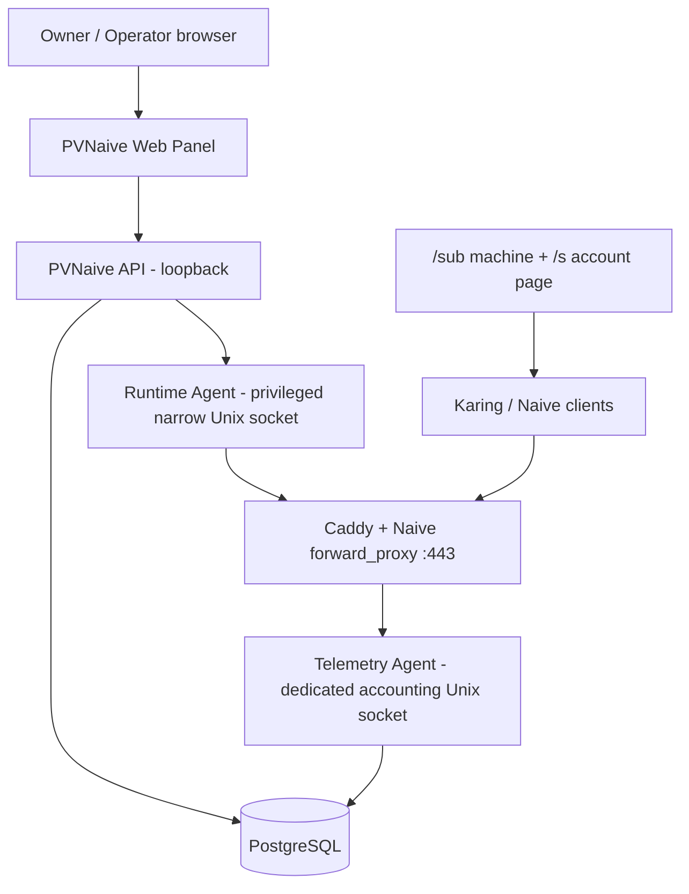

# معماری فعلی PVNaive

آخرین reconciliation: 2026-08-30

## Scope فعلی: Standalone-first



در standalone فعلی هیچ سرور ایران، tunnel ایران یا Controller/fleet خارجی در availability path نیست. محصول باید حتی بدون fleet/controller روی یک سرور خارج مستقل کار کند.

## Boundaryهای اصلی

### 1. Management Plane

PVNaive API/Web مسئول state تجاری و عملیات مدیریتی است:

- Customer/User lifecycle؛
- `ServiceTerm`های immutable برای دوره‌های خرید/renewal؛
- plan/group/tag/note؛
- quota/expiry/reset policy metadata؛
- Subscription token lifecycle؛
- audit/idempotency؛
- Runtime desired/applied state؛
- operator UI.

API Production روی loopback می‌ماند و از طریق Caddy control surface public می‌شود. Web UI نباید availability data plane را کنترل کند.

### 2. Runtime credential plane

هویت اتصال Naive با business User یکی نیست.

- هر Runtime credential شناسه UUID پایدار دارد؛
- secret با envelope encryption نگه‌داری می‌شود؛
- raw password فقط در action صریح create/rotate one-time delivery می‌شود؛
- Customer می‌تواند به Runtime credential موجود adopt/bind شود بدون تغییر password؛
- quota/expiry edit نباید Runtime password یا Subscription token را rotate کند.

### 3. Privileged Runtime Agent

API unprivileged نباید arbitrary root shell/path/service control داشته باشد.

Runtime mutation فقط از local narrow AF_UNIX agent انجام می‌شود و برای Caddy credential state از این الگو استفاده می‌کند:

`inspect/expected SHA → exact backup → render bounded change → validate → install/apply → reload → postflight → rollback on failure`

Desired/Applied Revision و reconciliation-required state برای failureهای consistency حفظ می‌شوند.

### 4. Data plane

- TLS معتبر روی TCP/443؛
- standard NaiveProxy/forward_proxy behavior؛
- multi-credential authentication؛
- camouflage/ordinary website برای مسیر عادی/probe؛
- active client traffic نباید به Web UI وابسته باشد؛
- wire protocol اختصاصی یا fake/chaff traffic پیش‌فرض ساخته نمی‌شود.

## مدل تجاری

مدل اصلی به‌صورت مفهومی:

```text
Tenant / Actor
      |
      +--> User / Customer
              |
              +--> immutable ServiceTerm(s)
              |       - quota
              |       - validity/expiry
              |       - reset policy metadata
              |       - plan snapshot
              |
              +--> RuntimeCredential binding
              |
              +--> SubscriptionToken(s)
```

Renewal باید ServiceTerm جدید بسازد و usage دوره قبلی را rewrite نکند.

## Subscription / Account Page boundary

- `/sub/<token>`: machine/client Subscription endpoint؛
- `/s/<token>`: human Account Page؛
- local QR generation؛
- token خام فقط one-time delivery و DB فقط digest/prefix غیرحساس؛
- read/view/copy mutation ایجاد نمی‌کند؛
- Subscription reissue و password rotation دو action مستقل هستند؛
- request Host header منبع canonical Naive destination نیست.

## Exact Direct-Naive Accounting

Accounting دیگر PoC صرف نیست. WS1 در current main/Production یک trusted direct path ایجاد کرده است.

### Write-boundary producer

Instrumentation در successful authenticated Naive CONNECT/write path قرار دارد تا identity و counters از Runtime واقعی بیایند، نه از access-log estimate.

### Identity

Billing identity = stable Runtime credential UUID که به User/ServiceTerm map می‌شود.

### Telemetry boundary

Caddy/forwardproxy producer از یک Unix socket اختصاصی به `pvnaive-telemetry-agent` گزارش می‌دهد. این socket از Runtime mutation socket جداست تا permission/lifecycle یک سرویس دیگری را خراب نکند.

### Event model

Event/accounting semantics شامل:

- boot identity؛
- session identity؛
- sequence؛
- cumulative upload/download counters؛
- duplicate handling؛
- conflict/gap detection؛
- counter regression/reset detection؛
- append-only/idempotent ingest؛
- restart/reconnect-safe projection.

`ServiceTerm` boundary مصرف یک دوره خرید را از renewal بعدی جدا می‌کند.

اگر legacy/adopted history قبل از trusted boundary قابل اثبات نباشد، باید `Unknown` گزارش شود، نه fake zero.

## First Successful Connection

`on_first_successful_connection` فقط از successful authenticated Runtime CONNECT شروع می‌شود.

این‌ها activation ایجاد نمی‌کنند:

- View QR؛
- `/sub`؛
- `/s`؛
- API read؛
- health check؛
- Caddy reload؛
- failed authentication.

Atomic activation core وجود دارد. Controlled Production acceptance برای duplicate/concurrent/reconnect/restart هنوز یک DoD مستقل است.

## Hard Quota

Finite quota enforcement از shared reservation/settlement budget استفاده می‌کند تا simultaneous connections نتوانند independent remaining quota ببینند و از budget عبور کنند.

Core وجود دارد؛ Production acceptance هنوز باید exact exhaustion، races، reload/restart/reconnect، عدم negative remaining و عدم bypass را ثابت کند.

Manual Reset Usage و periodic reset execution capabilityهای جدا هستند و صرف وجود reset policy metadata به معنی اجراشدن آنها نیست.

## Sessions / Presence

Trusted accounting path session/presence projection دارد، اما operator-facing session list/kill/concurrent-IP enforcement هنوز Product-complete نیست.

هیچ HWID/device identity یا per-user speed control نباید تا قبل از data-plane/client PoC قابل‌اعتماد به شکل جعلی در UI عرضه شود.

## PostgreSQL

PostgreSQL مبنای Production است؛ audit مورخ 2026-08-30 schema 11 را ثبت کرد.

SQLite مسیر Production فعلی نیست و نباید به‌عنوان گزینه هم‌ارز در installer جاری معرفی شود مگر ADR/benchmark جدیدی آن را باز کند.

پایگاه داده management desired state، commercial history، audit، subscription digests و exact accounting projections/events را نگه می‌دارد. RLS/tenant boundaries باید در کنار HTTP authorization حفظ شوند.

## Availability / failure model

- Web/API failure نباید active Naive sessions را بی‌جهت قطع کند؛
- Runtime mutation failure باید fail-closed و rollback-aware باشد؛
- double failure باید reconciliation-required state بدهد، نه success مبهم؛
- telemetry/accounting incomplete state نباید fake usage تولید کند؛
- generic authenticated HTTP mutation هنوز commit-before-success bug باز دارد و باید fix شود؛
- readiness هنوز باید DB/schema-backed شود.

## Backup / Operations

Encrypted backup/restore foundation وجود دارد، اما scheduled product backup هنوز در Production audit 2026-08-30 timer فعال نداشت.

قبل از هر Production mutation:

`read-only preflight → DB/config/Caddy/web/binary backups → rollback plan → validate → bounded apply → postflight → rollback-on-failure → evidence`

Root filesystem در audit 2026-08-30 حدود 79% مصرف داشت؛ backup/load-test باید قبل از اجرا capacity را دوباره بررسی کند.

## آینده: Fleet / Multi-node

Boundaryهای standalone از حالا desired/applied revision و local agent separation را حفظ می‌کنند، اما multi-node هنوز current dependency نیست.

بعد از بسته‌شدن P0/P1 standalone می‌توان اضافه کرد:

- Node model/auth؛
- health/metrics/capacity؛
- User → Node assignment؛
- remote deployment؛
- desired/applied state + reconciliation loop؛
- drain/maintenance/canary؛
- node upgrade/rollback؛
- failover؛
- smart selection بر اساس health/load/bandwidth/latency/capacity؛
- fleet dashboard.

Controller قطع‌شده نباید standalone last-known-good data plane را از کار بیندازد.

## Security / privacy invariants

- secret plaintext در log/audit/list response نیست؛
- Subscription token خام در DB نیست؛
- destination browsing history کاربران برای billing ذخیره نمی‌شود؛
- فقط حداقل IP/session history موردنیاز عملیات با retention محدود در آینده نگه‌داری شود؛
- API authorization + tenant/RLS + IDOR tests لازم‌اند؛
- release/installer باید version-pinned/checksummed باشد؛
- final RC نیاز به SBOM/SAST/secret/dependency scanning/signing/provenance دارد؛
- GPL/AGPL competitor code بدون license review وارد PVNaive نمی‌شود.

## Current architectural source of truth

در صورت تعارض اسناد تاریخی:

1. current implementation/tests؛
2. current Production evidence؛
3. `PROJECT_STATUS.md` / `HANDOFF.md` / `KNOWN_ISSUES.md`؛
4. این سند و `docs/DECISIONS_FA.md`؛
5. historical stage docs.

Route declaration یا schema table به‌تنهایی implementation evidence نیست.
