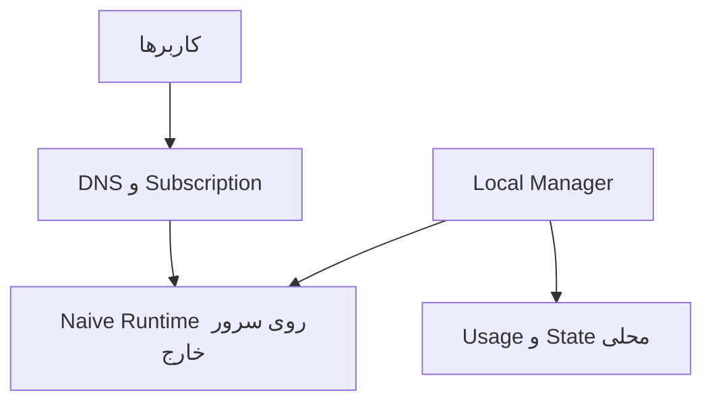

# معماری پیشنهادی

## Scope نسخهٔ اول: Standalone

در نسخهٔ اول هیچ سرور ایران، تونل ایران، Controller خارجی یا fleet چندنودی در مسیر نیست. محصول باید روی یک سرور خارج مستقل نصب و اداره شود.

## اجزای نسخهٔ مستقل

### Local Manager

- API و Web UI محلی
- user/credential/quota/expiry
- Subscription token و renderer
- مدیریت certificate و runtime
- health، usage، audit و backup
- validate → stage → apply → verify → rollback
- نگه‌داری last-known-good

### Data plane

- Listener اصلی TCP/443 با TLS معتبر و HTTP/2
- Naive استاندارد و به‌روز
- credential یکتا برای هر user یا policy
- وب‌سایت عادی برای درخواست نامعتبر و probe
- محدودسازی connection/rate بدون تغییر غیرضروری fingerprint
- عدم وابستگی sessionهای فعال به Web UI

### ذخیره‌سازی

برای PoC و نصب کوچک می‌توان SQLite را بررسی کرد. برای بار Production و ledger قابل اتکا، PostgreSQL گزینهٔ اصلی باقی می‌ماند. انتخاب نهایی بعد از benchmark انجام می‌شود.

## مدل‌های اصلی داده در Standalone

- `User`: وضعیت، حجم، انقضا و گروه
- `Credential`: شناسه، secret امن، user و revision
- `Policy`: quota/reset/concurrency
- `RuntimeRevision`: staged/applied/last-known-good
- `UsageDelta` و `UsageLedger`
- `SubscriptionToken`
- `HealthSample`
- `AuditEvent`

## حسابداری مصرف

1. Runtime باید delta قابل اتکا برای هر credential تولید کند.
2. هر delta دارای `boot_id + sequence` باشد.
3. ذخیره‌سازی با idempotency از دوباره‌شماری جلوگیری کند.
4. restart و counter reset صریح تشخیص داده شوند.
5. ledger append-only باشد و aggregateها قابل بازسازی باشند.
6. enforcement quota محلی باشد.

تا قبل از اثبات این موارد، quota دقیق آماده محسوب نمی‌شود.

## آمادگی برای اتصال به پنل آینده

Standalone نباید از ابتدا به Controller نیاز داشته باشد؛ اما boundaryهای زیر حفظ می‌شوند:

- Manager از Runtime از طریق یک adapter داخلی استفاده کند.
- desired state و applied revision از هم جدا باشند.
- شناسهٔ نصب و schema دارای version باشند.
- بعداً Agent بتواند به‌صورت outbound-only و با mTLS به Controller وصل شود.
- حالت متصل اختیاری باشد و با قطع Controller به standalone last-known-good برگردد.
- API داخلی با contract نسخه‌بندی‌شده طراحی شود.

## معماری آینده؛ خارج از Scope فعلی

بعداً همین نرم‌افزار می‌تواند roleهای `controller` و `node` بگیرد و چند سرور خارجی را مدیریت کند. سرور یا پهنای‌باند ایران فقط در یک پروژه/مرحلهٔ جداگانه بررسی خواهد شد و بخشی از طراحی فعلی نیست.

## امنیت

- پنل مدیریت و data plane در صورت امکان دامنه یا سطح دسترسی جدا داشته باشند.
- secret plaintext در log و audit نوشته نشود.
- credential و subscription token قابل revoke و rotate باشند.
- backup رمزنگاری‌شده و restore قابل آزمایش باشد.
- release و installer دارای version pin و checksum باشند.
- مقصدهای مرور کاربران ذخیره نشوند؛ فقط دادهٔ حداقلی لازم برای عملیات و billing.
