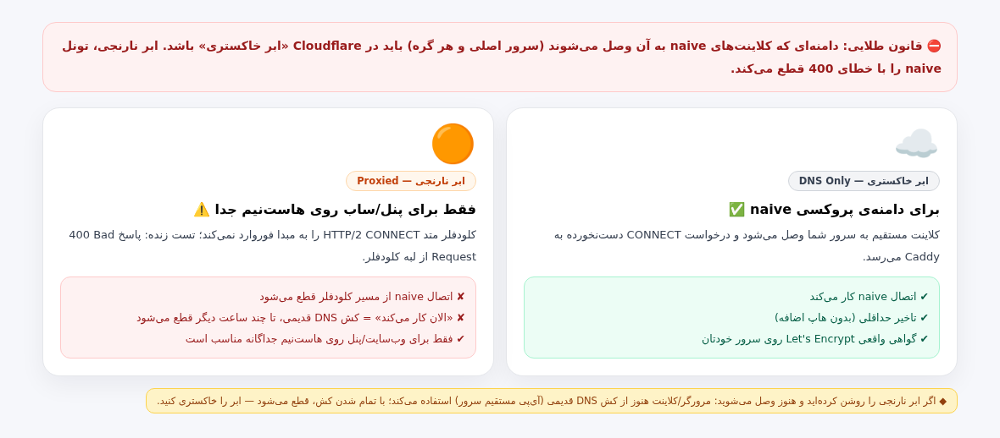
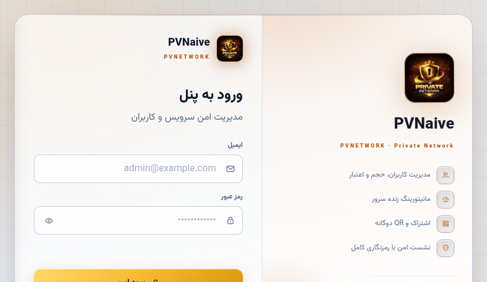
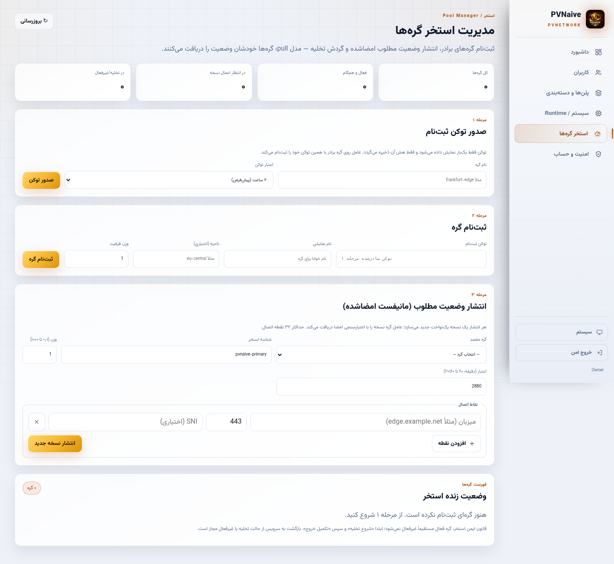
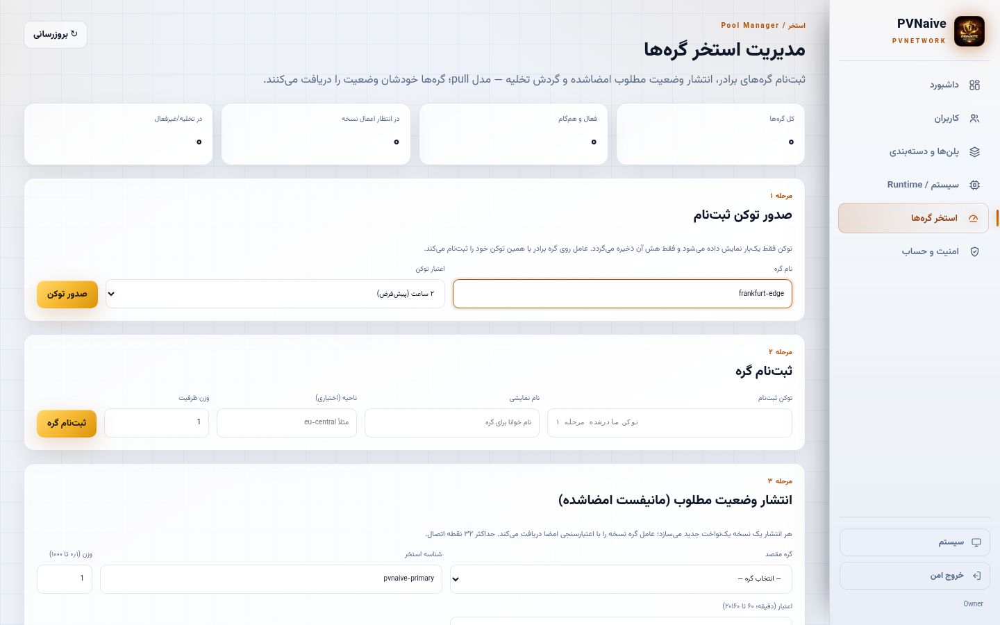
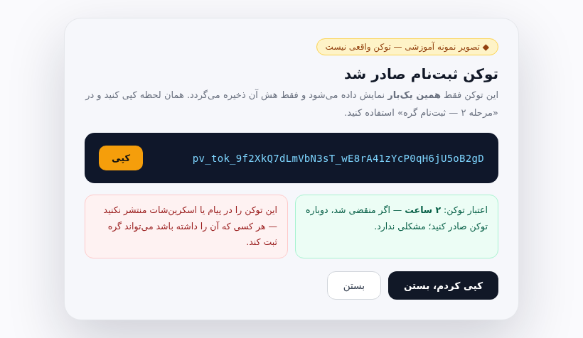
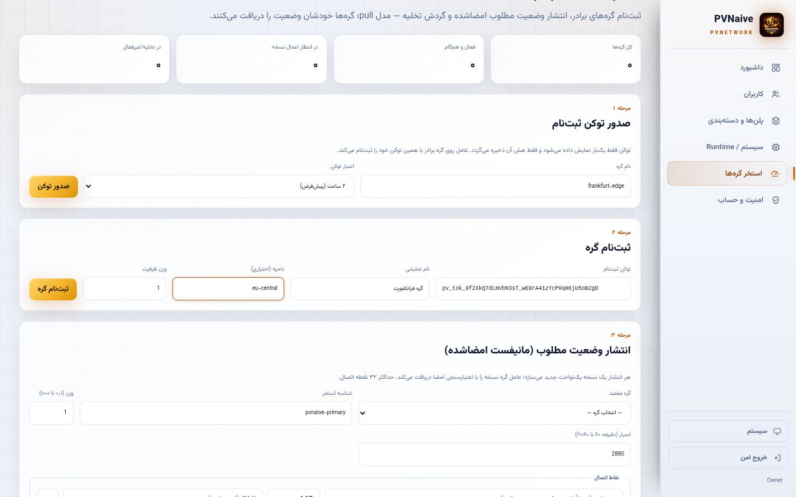
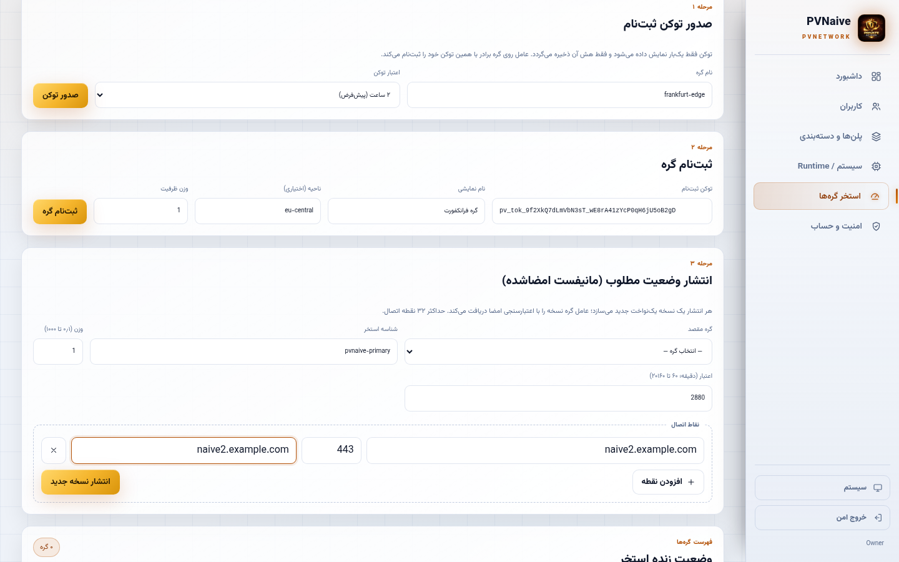
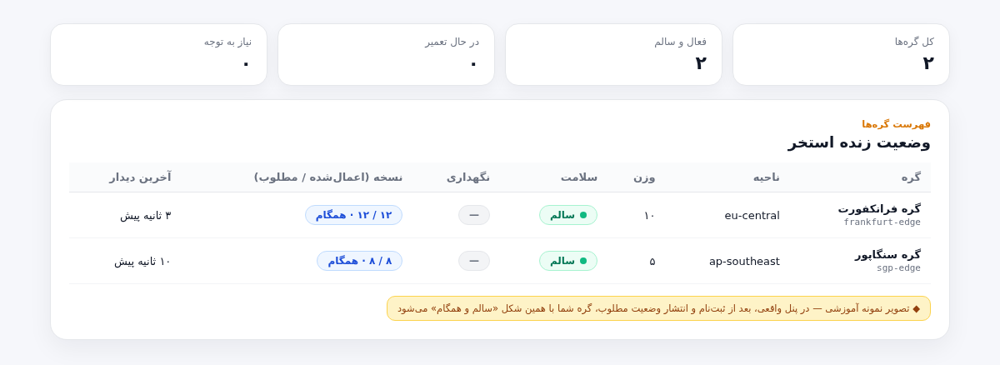
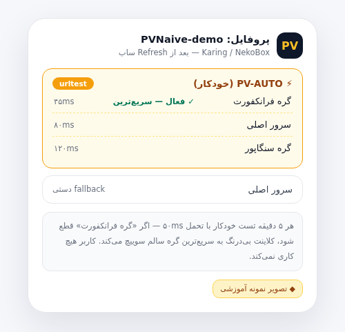

# آموزش گام‌به‌گام افزودن گره (سرور دوم) به استخر PVNaive

> این راهنمای تصویری، همان قابلیتی را پوشش می‌دهد که از روز اول خواسته بودید:
> **«چند سرور اضافه کنم و خود سیستم بررسی کند کدام بهتر است و اتوماتیک سوییچ کند.»**
> در پایان این آموزش، هر کاربری یک گروه خودکار به نام **`PV-AUTO`** در کلاینت خود دارد که
> هر ۵ دقیقه همه‌ی گره‌ها را تست می‌کند و همیشه از سریع‌ترین گره سالم استفاده می‌کند.

---

## ۱) این آموزش چه چیزی می‌سازد؟

پنل PVNaive مدل **استخر گره (Node Pool)** دارد: سرور اولی که پنل روی آن نصب است «پنل اصلی» می‌ماند و
هر سرور دیگری که با دستور نصب تک‌خطی بالا می‌آورید، می‌تواند به‌عنوان «گره» ثبت شود. پنل اصلی برای هر گره یک
**مانیفست امضاشده (Ed25519)** منتشر می‌کند و گره با مدل Pull وضعیت خود را از پنل می‌کشد؛ یعنی گره هیچ
دسترسی مستقیم به دیتابیس پنل ندارد و اگر پنل موقتاً در دسترس نباشد، گره آخرین وضعیت سالم خود را نگه می‌دارد
(last-known-good) و کاربران قطع نمی‌شوند.


مصرف کاربران روی همه‌ی گره‌ها در دیتابیس پنل اصلی **تجمیع** می‌شود؛ یعنی حجم و اعتبار یک کاربر روی همه‌ی
گره‌ها یکی است و سقف حجمی او بر اساس مجموع مصرف همه‌ی گره‌ها کنترل می‌شود.

---

## ۲) پیشنیازها — قبل از شروع این‌ها را آماده کنید

| # | پیشنیاز | توضیح |
|---|---------|-------|
| ۱ | سرور دوم | Ubuntu 22.04/24.04 — حداقل ۱ vCPU و ۱GB رم — دسترسی root |
| ۲ | دامنه یا زیردامنه‌ی اختصاصی برای گره | مثلاً `edge2.example.com` — رکورد `A` آن به IP سرور دوم اشاره کند |
| ۳ | پورت‌های باز | `80` و `443` (پورت 80 فقط برای صدور گواهی Let's Encrypt لازم است) |
| ۴ | پنل اصلی در دسترس | باید بتوانید با حساب Owner به `https://naive.softarg.ir/panel/` وارد شوید |
| ۵ | ☁️ تنظیم Cloudflare | دامنه‌ی گره باید **ابر خاکستری (DNS Only)** باشد — بخش ۳ |

---

## ۳) ⛔ قانون طلایی Cloudflare — ابر خاکستری، نه نارنجی

دامنه‌ای که کلاینت‌های naive به آن وصل می‌شوند (دامنه‌ی سرور اصلی و دامنه‌ی هر گره) باید در Cloudflare
**ابر خاکستری (DNS Only)** باشد. اگر ابر نارنجی (Proxied) را روشن کنید، کلودفلر متد
`HTTP/2 CONNECT` را به سرور شما فوروارد نمی‌کند و اتصال naive با خطای `400 Bad Request`
از لبه‌ی کلودفلر قطع می‌شود.

> **نکته‌ی مهم:** اگر ابر نارنجی را تازه روشن کرده‌اید و «الان کار می‌کند»، به این معنی نیست که مشکلی ندارد —
> کلاینت شما هنوز از **کش DNS قدیمی** (آی‌پی مستقیم سرور) استفاده می‌کند. با خالی شدن کش (چند دقیقه تا
> چند ساعت بسته به ISP)، اتصال‌های جدید قطع می‌شوند. ابر را خاکستری کنید.
> ابر نارنجی فقط برای هاست‌نیم‌های جداگانه‌ی وب (مثلاً سایت معرفی یا صفحه‌ی دانلود) مناسب است، نه دامنه‌ی پروکسی.



---

## ۴) مرحله ۰ — نصب سرور دوم (دستور تک‌خطی)

روی سرور دوم ( fresh Ubuntu) این یک خط را اجرا کنید — همان نصب‌کننده‌ای که سرور اول را بالا آورده:

```bash
PVNAIVE_DOMAIN=edge2.example.com bash <(curl -fsSL \
  https://raw.githubusercontent.com/DashSaman/PV-NativePanel/main/docker/install.sh)
```

- `PVNAIVE_DOMAIN` را با دامنه‌ی **خود سرور دوم** عوض کنید (رکورد DNS باید از قبل به IP این سرور اشاره کند).
- اگر دامنه ندهید، نصب با IP و گواهی self-signed انجام می‌شود؛ برای گره توصیه نمی‌شود چون کلاینت‌ها SNI واقعی می‌خواهند.
- نصب‌کننده Docker را بررسی می‌کند، رمزهای قوی می‌سازد، ایمیج را build و استک را بالا می‌آورد و در پایان
  **URL پنل، ایمیل/رمز Owner و اعتبار پروکسی بوت‌استرپ** را یک‌بار چاپ می‌کند — آن‌ها را ذخیره کنید.
- پنلِ سرور دوم مستقل است (کاربران خودش را دارد)؛ چیزی که این سرور را «گرهِ» پنل اصلی می‌کند،
  **ثبت‌نام در پنل اصلی** است که در مراحل بعد انجام می‌شود.

<details>
<summary>این دستور دقیقاً چه‌کار می‌کند؟ (باز کنید)</summary>

1. اجرای sudo/root و بررسی Docker + Docker Compose v2؛
2. کلون سطح‌اول (shallow) ریپو در `/opt/pvnaive/PV-NativePanel`؛
3. ساخت رمزهای قوی و نوشتن آن‌ها در `data/.env` با دسترسی `0600`؛
4. build ایمیج و `docker compose up -d`؛
5. انتظار برای آماده شدن پروب سلامت `GET /api/v1/health/ready` و چاپ اطلاعات ورود.

برای به‌روزرسانی بعدی همان دستور را دوباره اجرا کنید — نصب idempotent است و رمزهای موجود حفظ می‌شوند.
</details>

---

## ۵) مرحله ۱ — صدور توکن ثبت‌نام در پنل اصلی

1. با حساب Owner وارد پنل اصلی شوید:



2. از منوی کنار، بخش **«استخر گره‌ها»** را باز کنید (`#/pool`). صفحه‌ی مدیریت استخر چهار بخش دارد:
   صدور توکن، ثبت‌نام گره، انتشار وضعیت مطلوب و جدول وضعیت زنده:



3. در **مرحله ۱ — صدور توکن ثبت‌نام**، یک نام برای گره بنویسید (مثلاً `frankfurt-edge`) و اعتبار توکن را
   انتخاب کنید (پیش‌فرض ۲ ساعت کافی است) و روی **«صدور توکن»** بزنید:



4. توکن **فقط همین یک‌بار** نمایش داده می‌شود و فقط هش آن ذخیره می‌گردد — همان لحظه کپی کنید:



> اگر توکن منقضی شد یا گم شد، مشکلی نیست — دوباره توکن صادر کنید. توکن بدون دسترسی Owner قابل استفاده نیست.

---

## ۶) مرحله ۲ — ثبت‌نام گره

در **مرحله ۲ — ثبت‌نام گره** همان صفحه:

- **توکن ثبت‌نام:** توکنی که در مرحله قبل کپی کردید؛
- **نام نمایشی:** نام خوانا (مثلاً «گره فرانکفورت») — همان نامی که در ساب کاربر دیده می‌شود؛
- **ناحیه (اختیاری):** مثلاً `eu-central` — برای دسته‌بندی و گزارش؛
- **وزن ظرفیت:** عدد ۱ تا ۱۰۰۰۰. وزن در گروه خودکار کلاینت اثر دارد؛ برای گره‌های قوی‌تر عدد بزرگ‌تر بگذارید
  (وزن پیش‌فرض ۱ برای شروع کافی است).

و روی **«ثبت‌نام گره»** بزنید. پیام «گره «...» ثبت‌نام شد» را می‌بینید و گره در جدول پایین صفحه ظاهر می‌شود.



---

## ۷) مرحله ۳ — انتشار وضعیت مطلوب (مانیفست امضاشده)

ثبت‌نام فقط «گره را به استخر اضافه می‌کند»؛ تا وقتی برای آن **وضعیت مطلوب (Desired State)** منتشر نکنید،
گره در ساب کاربران ظاهر نمی‌شود. در **مرحله ۳ — انتشار وضعیت مطلوب (مانیفست امضاشده)**:

- **گره مقصد:** گره‌ای که مرحله ۲ ثبت کردید؛
- **شناسه استخر:** پیش‌فرض `pvnaive-primary` را نگه دارید؛
- **وزن:** وزن این گره در مانیفست (۰٫۱ تا ۱۰۰۰)؛
- **اعتبار (دقیقه):** مدت اعتبار مانیفست — پیشنهاد: `2880` (۴۸ ساعت). اگر گره ۴۸ ساعت نتواند به پنل برسد،
  مانیفست منقضی می‌شود و گره سقف ایمنی را اعمال می‌کند؛
- **نقاط اتصال:** برای هر نقطه: **میزبان** = دامنه‌ی گره (مثلاً `edge2.example.com`)، **پورت** = `443`،
  **SNI** = همان دامنه‌ی گره. با «افزودن نقطه» می‌توانید تا ۳۲ نقطه (IP/دامنه‌ی جایگزین) اضافه کنید.

روی **«انتشار نسخه جدید»** بزنید — پنل مانیفست را با کلید Ed25519 امضا می‌کند و نسخه‌ی یکنواخت جدید ثبت می‌شود.
گره در چرخه Pull بعدی آن را دریافت و اعمال می‌کند.



> هر تغییر بعدی (وزن، نقطه اتصال، SNI) را با همین فرم و «انتشار نسخه جدید» اعمال کنید — هر انتشار یک نسخه‌ی
> جدید می‌سازد و ستون نسخه در جدول، «اعمال‌شده» و «مطلوب» را مقایسه می‌دهد.

---

## ۸) مرحله ۴ — تأیید سلامت و همگامی

در جدول **«وضعیت زنده استخر»** پایین همان صفحه، گره شما باید بعد از اولین Pull عامل گره:

- **سلامت:** سبز و «سالم» شود؛
- **نسخه:** «همگام» شود — یعنی `اعمال‌شده = مطلوب`؛
- **آخرین دیدار:** چند ثانیه پیش به‌روز شود.



تا وقتی گره «همگام» نیست، در ساب کاربران اعمال نمی‌شود و اتفاقی برای کاربران نمی‌افتد؛ خطا را از بخش عیب‌یابی
پایین صفحه پیدا کنید.

---

## ۹) نتیجه — کلاینت‌ها چه می‌بینند؟

از این لحظه، هر کاربری که ساب خود را **Refresh** کند، همه‌ی گره‌های سالم استخر را داخل پروفایل خود می‌بیند:

- **Karing / sing-box:** یک گروه خودکار **`PV-AUTO`** (نوع urltest) ساخته می‌شود که هر ۵ دقیقه همه‌ی گره‌ها را
  تست می‌کند (تحمل ۵۰ms) و همیشه از **سریع‌ترین گره سالم** استفاده می‌کند؛
- **Mihomo / Clash:** همان رفتار با گروه `url-test` از طریق proxy-provider (به‌روزرسانی داغ هر ۴ ساعت)؛
- **NekoBox / NekoRay:** گره‌ها به‌صورت سرورهای جدا در گروه subscription می‌آیند و می‌توانید دستی یا با
  گروه‌بندی بین آن‌ها سوییچ کنید؛
- حذف/خرابی/تعمیر یک گره **بدون قطع کردن کاربران** از ساب حذف می‌شود و کلاینت خودش به بعدی سوییچ می‌کند.



---

## ۱۰) نگهداری روزمره

| کار | کجا | چه اتفاقی می‌افتد |
|-----|-----|-------------------|
| بردن گره به **حالت تعمیر (تخلیه)** | جدول استخر ← منوی سه‌نقطه‌ی ردیف | گره از ساب جدید کاربران خارج می‌شود بدون قطع اتصال‌های فعلی؛ برای تعمیر/به‌روزرسانی |
| خروج از حالت تعمیر | همان منو | گره دوباره به استخر سالم برمی‌گردد |
| تغییر وزن / نقاط اتصال | مرحله ۳ ← انتشار نسخه جدید | نسخه‌ی جدید مانیفست منتشر و روی گره اعمال می‌شود |
| غیرفعال کردن کامل گره | حالت نگهداری «غیرفعال» | گره از همه‌ی ساب‌ها حذف می‌شود |
| به‌روزرسانی نرم‌افزار گره | روی سرور گره: همان [دستور تک‌خطی](#۴-مرحله-۰--نصب-سرور-دوم-دستور-تکخطی) | نصب idempotent؛ داده‌ها و رمزها حفظ می‌شوند |

---

## ۱۱) عیب‌یابی

| نشانه | علت رایج | راه‌حل |
|-------|----------|--------|
| «توکن نامعتبر/منقضی/استفاده‌شده» هنگام ثبت‌نام | توکن قدیمی یا اشتباه کپی شده | دوباره در مرحله ۱ توکن صادر کنید و همان لحظه استفاده کنید |
| گره ثبت شده ولی سبز/همگام نمی‌شود | وضعیت مطلوب منتشر نشده یا عامل گره به پنل نمی‌رسد | مرحله ۳ را کامل کنید؛ اتصال سرور گره به پنل اصلی روی پورت Pull را بررسی کنید |
| کاربر با گره وصل نمی‌شود ولی پنل بالا است | ابر نارنجی Cloudflare روی دامنه‌ی گره، یا پورت 443 بسته، یا SNI اشتباه در مرحله ۳ | ابر را خاکستری کنید؛ پورت 443 را باز کنید؛ SNI را دقیقاً دامنه‌ی گره بگذارید و نسخه‌ی جدید منتشر کنید |
| گره گواهی Let's Encrypt نمی‌گیرد | رکورد DNS به IP درست اشاره نمی‌کند یا پورت 80 بسته است | `dig +short <دامنه>` را چک کنید و پورت 80 را موقتاً باز کنید |
| بعد از حذف یک گره، برخی کاربران قطع شدند | کلاینت هنوز ساب قدیمی را دارد | کاربر ساب را Refresh کند؛ گروه PV-AUTO خودش به گره سالم سوییچ می‌کند |
| «در پنل: استخر گره‌ها در دسترس نیست» | سرویس Pool روی نصب شما فعال نیست | با دستور `pvnaive doctor` وضعیت را ببینید یا نصب را با آخرین نسخه به‌روز کنید |

---

## ۱۲) تنظیمات پیشرفته (اختیاری)

**Pull Listener روی پنل اصلی (mTLS):** گره‌ها مانیفست را از شنونده‌ی اختصاصی mTLS می‌کشند؛ هویت گره فقط از
گواهی TLS کلاینت (URI SAN `urn:pvnaive:node:<id>`) خوانده می‌شود و بدون گواهی معتبر، درخواست با 401/403
رد می‌شود (fail-closed). فعال‌سازی روی پنل اصلی با متغیرهای زیر است (همه با هم یا هیچ‌کدام):

```bash
PVNAIVE_FLEET_PULL_LISTEN=:9443        # آدرس شنونده
PVNAIVE_FLEET_PULL_CERT_FILE=...       # گواهی سرور
PVNAIVE_FLEET_PULL_KEY_FILE=...        # کلید سرور
PVNAIVE_FLEET_PULL_CLIENT_CA_FILE=...  # CA تایید گواهی گره‌ها
```

هر Pull همزمان نقش heartbeat را هم دارد (با هشدار اختلاف ساعت بیش از ۹۰ ثانیه). جزئیات طرح در
`docs/STEERING_SPEC_FA.md` §4 آمده است.

> **وضعیت شفاف قابلیت:** رابط کاربری استخر گره‌ها (توکن، ثبت‌نام، انتشار، تخلیه، مشاهده‌ی مانیفست امضاشده)
> کامل و زنده است؛ شنونده‌ی Pull mTLS نیز در کد کامل شده و آزمون‌های قراردادی دارد. تست نهایی چند‌گره‌ای روی
> میزبان‌های واقعی در نقشه‌ی راه باقی است (مسئله‌ی FLEET-001 در `KNOWN_ISSUES.md`) — قبل از مهاجرت واقعی
> کاربران، با یک گره آزمایشی end-to-end تست کنید.

---

## ۱۳) سوالات متداول

**چند گره می‌توانم اضافه کنم؟**
سقف سختی در UI نیست؛ هر گره یک ردیف در استخر است. برای هر گره سرور، دامنه و ثبت‌نام جداگانه لازم است.

**اگر پنل اصلی قطع شود چه می‌شود؟**
گره‌ها آخرین مانیفست سالم (last-known-good) را ادامه می‌دهند و اتصال کاربران قطع نمی‌شود؛ فقط تغییرات جدید
(وزن/گره جدید) تا برگشت پنل اعمال نمی‌شود.

**اگر یک گره فیلتر یا سرد شود؟**
گروه PV-AUTO در کلاینت هر ۵ دقیقه تست می‌کند؛ گره‌ی کند/قطع خودکار کنار می‌رود و کاربر به سریع‌ترین گره سالم
سوییچ می‌کند. برای خارج کردن دائمی، حالت نگهداری یا انتشار نسخه‌ی جدید بدون آن گره کافی است.

**حجم کاربر روی گره‌ها چطور حساب می‌شود؟**
اعتبار و سقف حجمی در دیتابیس پنل اصلی است و مصرف همه‌ی گره‌ها تجمیع می‌شود؛ کاربر فقط یک ساب دارد.

**آیا می‌توانم گره را بدون دامنه اضافه کنم؟**
فنی با IP + گواهی self-signed ممکن است ولی کلاینت‌های naive برای SNI به دامنه نیاز دارند — همیشه دامنه بدهید.
